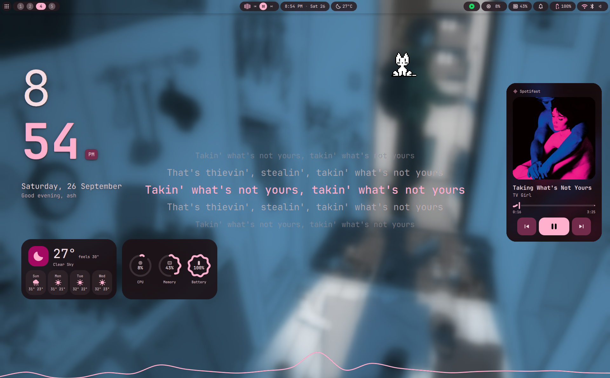

# Vayume

<p>
  <a href="https://github.com/aayush2622/Vayume/stargazers">
    
  </a>
  
  
  
  <a href="LICENSE"></a>
</p>

A NixOS flake configuration built around **niri** and **Hyprland** side-by-side — same keybinds, picked at the login screen — both driving [DankMaterialShell](https://github.com/AvengeMedia/DankMaterialShell), with a wallpaper-matching color theme that extends to editors, the browser, Discord, Spotify, Steam, Wine dialogs, GTK and Qt apps.

Written with [flake-parts](https://flake.parts/) + [import-tree](https://github.com/vic/import-tree), so every `.nix` file under `modules/` is picked up automatically — no import list to maintain.

> [!WARNING]
> This is my actual laptop's config, not a template you run as-is. Real disk UUIDs and login info live in two gitignored files that don't exist until you make them — the build refuses to evaluate without them, on purpose. Takes two minutes: **[Getting started](docs/getting-started.md)**.

If this saves you an evening, a star costs nothing. ⭐

<p align="center">
  
  
</p>
<p align="center">
  
</p>

---

## Table of Contents

- [What's Included](#whats-included)
- [Quick Start](#quick-start)
- [Configuration](#configuration)
- [Keybinds](#keybinds)
- [Project Layout](#project-layout)
- [Documentation](#documentation)
- [Credits](#credits)
- [License](#license)
- [Known Caveats](#known-caveats)

---

## What's Included

### Desktop
- **niri** and **Hyprland** — both always available, swappable at the greeter, with identical keybinds so muscle memory carries over
- **DankMaterialShell** — bar, launcher, notifications, lock screen, and a themed control center
- **Themed SDDM greeter** + **GRUB** — fixed themes (they run before any wallpaper colors exist); the greeter follows your `vayume.theme` cursor
- **kitty + zsh** with fastfetch, starship, and a curated plugin set

### Development
- **Editors:** VS Code, Android Studio, Zed — pre-configured with language-aware extension sets
- **Languages (one toggle each):** C++, Rust, Kotlin, Flutter/Dart, Nix, Qt, Python — each installs the toolchain *and* tells all enabled editors what to load
- **cc-switch** — switch Claude Code between API providers without hand-editing config
- **Dev tools:** ripgrep, fd, fzf, btop, nil, nixfmt, and more

### Gaming
- Steam, Lutris, Heroic Games Launcher, GE-Proton, MangoHud, gamemode
- Color-matched Wine dialogs and Proton prefixes

### Network
- **Cloudflare DNS over TLS** by default (opportunistic DoT)
- Network-stack hardening sysctls
- **Tor transparent proxy** behind a DMS control-center toggle — routes the whole machine, not just a browser

### Everything Else
- **Zen Browser** — chrome-scripted so its theme reloads live with matugen
- **File managers:** Nautilus + Thunar
- **Music:** Spicetify (Spotify) + Spotifast
- **Password management:** Bitwarden (desktop + rbw CLI)
- **Discord:** Vesktop + Vencord
- **ASUS hardware control:** DankAsusControlCenter widget
- **Waydroid** — Android apps with signature spoofing and microG
- **AppImage** support (`programs.appimage` with binfmt, so `.AppImage` files run directly)
- **Distrobox** — isolated Ubuntu escape hatch for the one-off proprietary tool
- **State backup CLI:** `vayume app-state backup|restore` — encrypted, portable `~/.config/vayume/session`

---

## Quick Start

### Prerequisites
- NixOS (flakes don't need to be enabled yet - this config turns them on; for the very first rebuild, `install.sh` prints the right command, or prefix it yourself with `sudo env NIX_CONFIG='experimental-features = nix-command flakes'`)
- UEFI boot
- `mkpasswd` (from `whois` package) for generating password hashes: `nix run nixpkgs#mkpasswd`

### Try on the Existing Host (Diablo)

```bash
git clone https://github.com/aayush2622/Vayume.git vayume
cd vayume
cp modules/hosts/Diablo/_hardware.nix.example modules/hosts/Diablo/_hardware.nix
cp modules/hosts/Diablo/_config.nix.example modules/hosts/Diablo/_config.nix
chmod 600 modules/hosts/Diablo/_config.nix  # it will hold password hashes
$EDITOR modules/hosts/Diablo/_config.nix   # at minimum, pick a username
sudo nixos-rebuild switch --flake path:.#Diablo
```

> **Why `path:.#Diablo`?** A bare flake ref resolves through git's *tracked files* view, making the gitignored `_hardware.nix` and `_config.nix` appear missing. `path:` reads the real directory as-is.

Any user without a `hashedPassword` gets `changeme` as a password. Users are immutable (`users.mutableUsers = false`), so `passwd` changes don't survive the next rebuild — set a real hash in `_config.nix`, or use **Vayume Settings → Users → Password** and rebuild.

### Make It Your Own Host

```bash
# Interactive (recommended)
./install.sh

# Or manual:
mkdir modules/hosts/<yourhostname>
cp modules/hosts/Diablo/{Host.nix,*.example} modules/hosts/<yourhostname>/
sudo nixos-generate-config --show-hardware-config > modules/hosts/<yourhostname>/_hardware.nix
# The host name is the folder name; edit Host.nix for timezone, locale, bootloader
cp modules/hosts/<yourhostname>/_config.nix.example modules/hosts/<yourhostname>/_config.nix
# Fill in _config.nix: username, password hash (mkpasswd -m sha-512), enable apps
sudo nixos-rebuild switch --flake path:.#<yourhostname>
```

`./install.sh --help` shows all flags; `--dry-run` previews without writing anything.

### Rebuild, roll back, test

```bash
vayume                                  # every Vayume helper, as a searchable menu (vayume help lists them)
vayume rebuild                          # after first boot: rebuild from wherever the repo lives, no password prompt (wheel users)
sudo nixos-rebuild switch --rollback    # back to the previous generation (older ones are in the GRUB menu)
nix run path:.#vm                       # boot this config in a throwaway QEMU VM first
./tests/eval.sh                         # does a fresh clone of the repo still evaluate? (what CI runs)
```

---

## Configuration

Everything you configure day-to-day lives in **one file**: `modules/hosts/<host>/_config.nix` (gitignored, required).

```nix
# modules/hosts/<host>/_config.nix
{ pkgs, ... }:
{
  vayume.users = {
    yourname = {
      fullName = "Your Name";
      extraGroups = [ "networkmanager" "wheel" "video" "input" ];  # "wheel" = sudo
      hashedPassword = "$6$...";  # mkpasswd -m sha-512
      secrets = {
        WAKATIME_API_KEY = "waka_...";
        RBW_EMAIL = "you@example.com";
      };
    };
  };

  vayume.apps = {
    Vscode.enable = true;
    Gaming.enable = true;
    Rust.enable = false;
    # ... one line per module under modules/apps/
  };
}
```

- **Type `vayume.apps.`** in an editor with Nix LSP — every available app appears by name. A typo is a real evaluation error, not a silently ignored entry.
- **Leave an app `false`** rather than deleting it — keeps it visible as "exists but off".
- **Default apps** (`vayume.defaultApps.editor = "zeditor";` etc.) pick which enabled app opens folders, links and code files, and which one the keybinds start — see [docs/desktop-default-apps.md](docs/desktop-default-apps.md).
- **DMS Control Center → Vayume Settings** edits this exact same file through a CLI (`vayume config`), not a separate database. The repo stays the single source of truth.
- **Secrets** live here too (`vayume.users.<name>.secrets`). Missing keys (or the whole block) fall back to `"REPLACE_ME"` placeholders — the consumer simply disables that feature instead of configuring it with a useless value. Full schema: [docs/core-users.md](docs/core-users.md).

---

## Keybinds

Same on both compositors. `Mod` = Super.

| Key | Action | Key | Action |
|-----|--------|-----|--------|
| `Mod+Return` | Terminal | `Mod+Q` / `Alt+F4` | Close window |
| `Mod+E` | Files | `Mod+W` | Float |
| `Mod+C` | Code editor | `Mod+F` / `Shift+F11` | Fullscreen |
| `Mod+B` | Browser | `Mod+←↑↓→` | Focus |
| `Mod+A` | Launcher | `Mod+Shift+←↑↓→` | Move window |
| `Mod+V` | Clipboard | `Mod+1–0` | Workspace |
| `Mod+Comma` | Settings | `Mod+Shift+1–0` | Send to workspace |
| `Mod+L` | Lock | `Mod+Shift+P` | Color picker |
| `Mod+Shift+W` | Wallpapers | `Print` / `Shift+Print` | Screenshot |

**Hyprland extras:** mouse-drag move/resize (`Mod`+left/right click), scratchpad on `Mod+S`, silent workspace moves on `Mod+Alt+1–0`.

Full lists: [Niri.nix](modules/desktop/Niri.nix) · [Hyprland.nix](modules/desktop/Hyprland.nix)

---

## Project Layout

```
flake.nix           inputs + import-tree ./modules
modules/
  vayume/           the settings schema itself — theme, users, apps, CLI/GUI backend
  core/             flake-parts wiring + shared app-registry framework
  lib/              shared helper values/functions
  hosts/<name>/     one machine: Host.nix + _hardware.nix (gitignored) + _config.nix (gitignored)
  desktop/          DE stack — compositor, shell, login theme, fonts, portals, GTK/Qt baseline
  system/           system-level infra unrelated to the desktop (Docker, GRUB, zram, network, Waydroid, VM harness)
  apps/             per-user opt-in modules (vayume.apps), one folder each
    development/      editors, languages, dev-tools, cc-switch
    gaming/           launchers, proton, performance tweaks
    utils/            terminal, browser, everything else
  assets/wallpapers/ default wallpaper set
```

**Add a person:** an entry in `_config.nix`.
**Add an app:** a folder under `modules/apps/*/` setting `flake.homeModules.apps.<Name>` — picked up automatically, then flip it on in `_config.nix`.
**Add a host:** `./install.sh`, or copy `Host.nix` + the `*.example` files from `modules/hosts/Diablo/`.

---

## Documentation

[**docs/CONFIGURATION.md**](docs/CONFIGURATION.md) is the index — one page per module, in the order you'd meet them, each linking to the next so it reads straight through. Start with **[Getting Started](docs/getting-started.md)**.

The `.nix` files stay comment-free; all the "why" lives in those pages.

---

## Credits

| Project | For |
|---------|-----|
| [niri](https://github.com/YaLTeR/niri) · [Hyprland](https://hypr.land) | The compositors |
| [DankMaterialShell](https://github.com/AvengeMedia/DankMaterialShell) | Bar, launcher, lock, theming |
| [matugen](https://github.com/InioX/matugen) | The color engine behind all of it |
| [home-manager](https://github.com/nix-community/home-manager) · [flake-parts](https://flake.parts/) · [import-tree](https://github.com/vic/import-tree) | The Nix plumbing |
| [Bibata](https://github.com/ful1e5/Bibata_Cursor) · [Catppuccin](https://github.com/catppuccin) | Cursor/editor theme |
| [cc-switch](https://github.com/farion1231/cc-switch) · [WakaTime](https://wakatime.com/) | Dev editor integrations |
| [Vencord](https://github.com/Vendicated/Vencord) · [DankAsusControl](https://github.com/shazzaam7/DankAsusControl) | Discord mods, ASUS widget |

Full pinned list: `flake.nix` inputs.

---

## License

[MIT](LICENSE). Use it, fork it, take what you want.

---

## Known Caveats

- **`dankAsusControlCenter`** builds fine but hasn't met real ASUS hardware in testing — see [docs/desktop-dms.md](docs/desktop-dms.md) if `asusctl`/`supergfxctl` won't cooperate.
- This config assumes a single-user laptop workflow. Multi-user setups work but haven't been exercised heavily.
- Waydroid's first boot takes a while (image download + signature spoofing patch).
- **Spotifast is pinned to one release, not "latest".** Nix needs a fixed hash for the prebuilt binary, so [`Spotifast.nix`](modules/apps/utils/spotifast/Spotifast.nix) names a single version (currently `0.9.1`) and its hash. It never updates by itself: a new release means bumping both by hand — see [docs/apps-utils-spotifast.md](docs/apps-utils-spotifast.md).